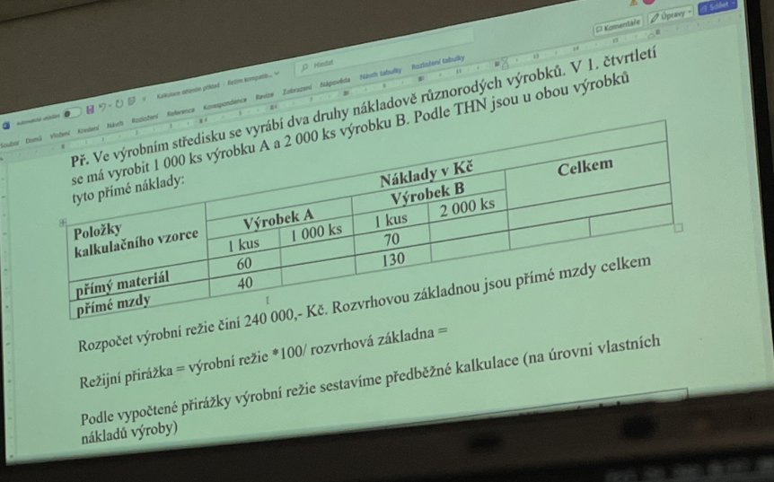
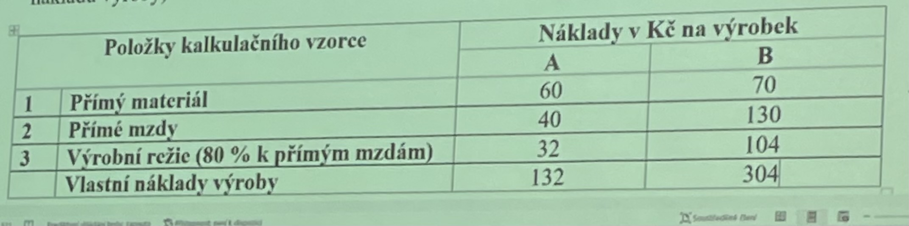
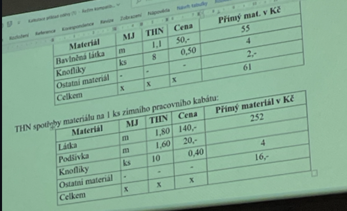
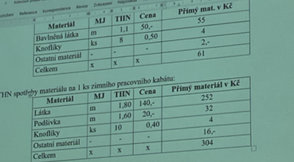
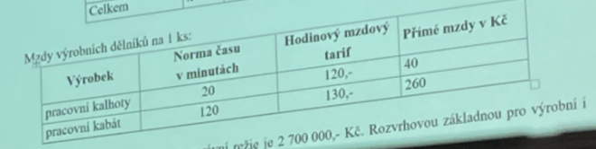
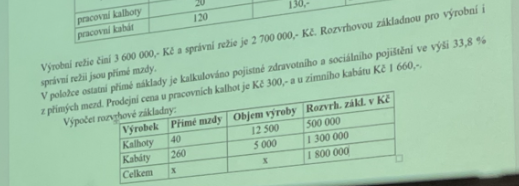

# Přímé náklady

- Jejich velikost můžeme nastavit přímo na kalkulační jednici

- Do přímých náklady patří:
    - Spotřeba materiálů 
    - Úkolové mdzy 
    - Socialní a zdravotní pojištění

# Nepřímé náklady (režíjní)

- Nelze je stanovit přesně na kalkulační jednici

- Sledují se podle hospodářských středisek (vnitro podnikové útvary)

- Podle hospodářských středisek rozlišujeme:
    - <b>Výrobní režije</b>: Vznikají ve výrobních střediscích (např:. Odpisy, režijní materiál, čistící materiál atd..)
    - <b>Správní režije</b>: Jsou to náklady spojené s řízení podniku jako celku (např:. Náklady administrativu, mzdy řídích pracovníku atd...)
    - <b>Zásobovací režije</b>: Náklady spojené se zajištěním materiálů (např:. Mzdy skladníků), někdy bývá součástí správní režije
    - <b>Odbytové náklady</b>: Jsou spojené s prodejem a propagací výrobku

- Kalkulace nastaví výšší nákladů, výnosu a zisků na kalkulační jednici
    - <b>Předběžná kalkulace</b>
        - Stanoví se před zahajením výroby
        - Stanoví se na nějakých normách
        - Je podkladem pro stanovení ceny
    - <b>Výsledná kalkulace</b>
        - Stanoví se po skončení výroby
        - Zjištujeme rozdíl o proti předběžné kalkulaci

- Typový kalkulační vzorce:
    1. Přímý materiál
    2. Příme mzdy
    3. Ostatní příme náklady
    4. <u>Výrobní režie    </u>
    <b>Vlastní náklady výroby</b>
    5. <u>Správní režie   </u>
    <b>VLastní náklady výkonu</b>
    6. <u>Odbytové náklady   </u>
    <b>Úplné vlastní náklady výkonu</b>
    7. <u>Zisk   </u>
    <b>Prodejní cena</b>
    8. <u>DPH   </u>
    <b>Prodejní cena s daní</b>

- Zisk
    - Může být stanovem přiřážkou
    - Nebou vyplyne jako rozdíl mezi prodejní cenou a uplnými vlastnimí naklady výkonu 

- Kalkulační metody
    - <b>Kalkulace dělením</b>
        - Používá se tam, kde se výrabějí stejné kalkulačních jednic (např:. Židle)
        - Podil nepřímých nákladů vypočítáme dělením

- Příklad: 

|Kalkulačka vzorec   |výpočet   |kalkulace židle   |
|---|---|---|
|Přímý   |   |   |
|   |   |   | 

- Kalkulace přířážková
    - Používý se tam, kde se vyrábí více druhů různorodých výrobků
    - 33.8

- Příklad
  - Výrobní režie 3 600 000kč
  - Správní režie 2 700 000kč
  - výrobní režie: 200% 
  - správní režie: 150%

|Položka kalk. vzorce            |Pracovní kalhoty    |Zimní kabáty   |
|---                             |---                 |---            |
|Přímý materiál                  |61                  |304               |
|Přímé mzdy                      |40                  |260               |
|Ostatní přímé náklady           |14                  |88               | 
|Výrobní režije _% přímých mezd  |80                  |520               |   
|Vlastní náklady výroby          |195                 |1172               |   
|Správní režije _% přímých mezd  |60                  |390               |
|Vlástní náklady výkonu          |255                 |1562               |
|Zisk                            |45                  |98               |
|Prodejní cena                   |300                 |1660               |