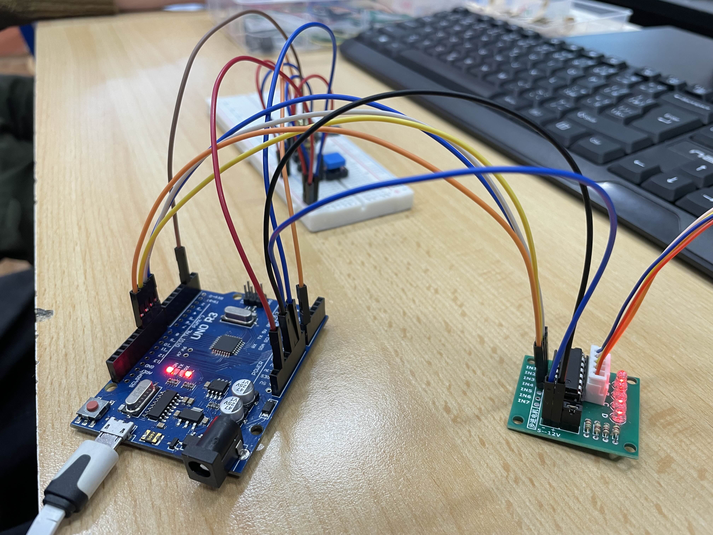
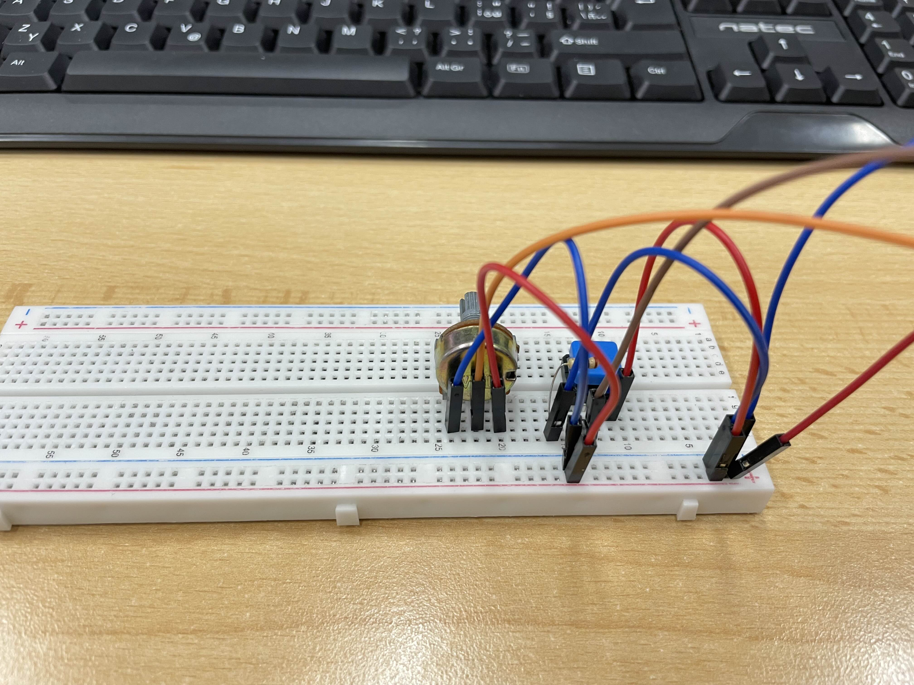
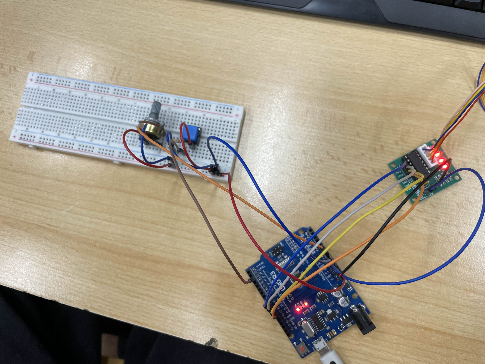

# Krokový motor

## Ilustrační obrázek


## Zapojení


## Základní informace
- Slouží k přesnému nastavení úhlu natočení
- Umožnuje otáčení kolém své osy (360°)
- Má 8 kroků
- Je řízen řadičem, který aktivuje jednotlivé fáze viz. zapojení [[1](#zapojení)]

## Ukázkový kód [[1](https://navody.dratek.cz/navody-k-produktum/krokovy-motor-a-driver.html)]
```C
// Krokový motor a driver

// čísla pinů pro digitální výstupy
const int in1 =  8;
const int in2 =  9;
const int in3 = 10;
const int in4 = 11;

// proměnná pro nastavení rychlosti,
// se zvětšujícím se číslem se rychlost zmenšuje
int rychlost = 1;
//
int uhel = 360;

void setup() {
  // inicializace digitálních výstupů
  pinMode(in1, OUTPUT);
  pinMode(in2, OUTPUT);
  pinMode(in3, OUTPUT);
  pinMode(in4, OUTPUT);
}

void loop() {
  // plná rotace o 360 stupňů = 512 volání
  // funkce rotacePoSmeru() či rotaceProtiSmeru()
  for(int i=0;i<(uhel*64/45);i++){
    rotacePoSmeru();
  }
  // pauza po dobu 1 vteřiny
  delay(1000);
  
  for(int i=0;i<(uhel*64/45);i++){
    rotaceProtiSmeru();
  }
  // pauza po dobu 1 vteřiny
  delay(1000);
}
// zde následují funkce pro volání jednotlivých
// kroků pro otočení po či proti směru hodinových
// ručiček
void rotacePoSmeru() {
  krok1();
  krok2();
  krok3();
  krok4();
  krok5();
  krok6();
  krok7();
  krok8();
}
void rotaceProtiSmeru() {
  krok8();
  krok7();
  krok6();
  krok5();
  krok4();
  krok3();
  krok2();
  krok1();
}
// každý krok obsahuje výrobcem dané pořadí
// pro správné spínání motoru a následnou
// pauzu, kterou určujeme rychlost otáčení
void krok1(){
  digitalWrite(in1, HIGH);
  digitalWrite(in2, LOW);
  digitalWrite(in3, LOW);
  digitalWrite(in4, LOW);
  delay(rychlost);
}
void krok2(){
  digitalWrite(in1, HIGH);
  digitalWrite(in2, HIGH);
  digitalWrite(in3, LOW);
  digitalWrite(in4, LOW);
  delay(rychlost);
}
void krok3(){
  digitalWrite(in1, LOW);
  digitalWrite(in2, HIGH);
  digitalWrite(in3, LOW);
  digitalWrite(in4, LOW);
  delay(rychlost);
}
void krok4(){
  digitalWrite(in1, LOW);
  digitalWrite(in2, HIGH);
  digitalWrite(in3, HIGH);
  digitalWrite(in4, LOW);
  delay(rychlost);
}
void krok5(){
  digitalWrite(in1, LOW);
  digitalWrite(in2, LOW);
  digitalWrite(in3, HIGH);
  digitalWrite(in4, LOW);
  delay(rychlost);
}
void krok6(){
  digitalWrite(in1, LOW);
  digitalWrite(in2, LOW);
  digitalWrite(in3, HIGH);
  digitalWrite(in4, HIGH);
  delay(rychlost);
}
void krok7(){
  digitalWrite(in1, LOW);
  digitalWrite(in2, LOW);
  digitalWrite(in3, LOW);
  digitalWrite(in4, HIGH);
  delay(rychlost);
}
void krok8(){
  digitalWrite(in1, HIGH);
  digitalWrite(in2, LOW);
  digitalWrite(in3, LOW);
  digitalWrite(in4, HIGH);
  delay(rychlost);
}
```

## Příklad ve škole
### Zadání:
- Pří stisku tlačítka udělá motor 1 otáčku
- Potencio metru řídí rychlost spoždění v rozsahu 1 - 10
- Každá stisknutí tlačítka jiný směr

### Zapojení:




### Kód:

```C
// krokovy motor
int IN1 = 8;
int IN2 = 9;
int IN3 = 10;
int IN4 = 11;

// tlacitko
int TLAC = 7;
int stavTLAC = 0;

// strana na kterou se tlacitko bude otacet
int STRANA = 0;

// potecnion metr
int POTENC = A0;
int POTENC_v = 0;

// dleay
int krok_delay = 1;

void setup() {
  // put your setup code here, to run once:
  pinMode(IN1, OUTPUT);
  pinMode(IN2, OUTPUT);
  pinMode(IN3, OUTPUT);
  pinMode(IN4, OUTPUT);

  pinMode(TLAC, INPUT);

  Serial.begin(9600);
}

void loop() {
  stavTLAC = digitalRead(TLAC);
  POTENC_v = analogRead(POTENC);

  
  krok_delay = POTENC_v/100;

  if(krok_delay == 0) {
    krok_delay = 1;
  }
  Serial.println(POTENC_v/100);

  if (stavTLAC == LOW) {
    
    if(STRANA == 0) {
      for(int i=0;i<(360*64/45);i++){
        rotacePoSmeru();
      }

      STRANA = 1;
    } else {
      for(int i=0;i<(360*64/45);i++){
        rotaceProtiSmeru();
      }

      STRANA = 0;
    }
  }
}


void rotacePoSmeru() {
  K1();
  K2();
  K3();
  K4();
  K5();
  K6();
  K7();
  K8();
}
void rotaceProtiSmeru() {
  K8();
  K7();
  K6();
  K5();
  K4();
  K3();
  K2();
  K1();
}


void K1(){
  digitalWrite(IN1, HIGH);
  digitalWrite(IN2, LOW);
  digitalWrite(IN3, LOW);
  digitalWrite(IN4, LOW);
  delay(krok_delay);
}
void K2(){
  digitalWrite(IN1, HIGH);
  digitalWrite(IN2, HIGH);
  digitalWrite(IN3, LOW);
  digitalWrite(IN4, LOW);
  delay(krok_delay);
}
void K3(){
  digitalWrite(IN1, LOW); 
  digitalWrite(IN2, HIGH);
  digitalWrite(IN3, LOW);
  digitalWrite(IN4, LOW);
  delay(krok_delay);
}
void K4(){
  digitalWrite(IN1, LOW);
  digitalWrite(IN2, HIGH);
  digitalWrite(IN3, HIGH);
  digitalWrite(IN4, LOW);
  delay(krok_delay);
}
void K5(){
  digitalWrite(IN1, LOW);
  digitalWrite(IN2, LOW);
  digitalWrite(IN3, HIGH);
  digitalWrite(IN4, LOW);
  delay(krok_delay);
}
void K6(){
  digitalWrite(IN1, LOW);
  digitalWrite(IN2, LOW);
  digitalWrite(IN3, HIGH);
  digitalWrite(IN4, HIGH);
  delay(krok_delay);
}
void K7(){
  digitalWrite(IN1, LOW);
  digitalWrite(IN2, LOW);
  digitalWrite(IN3, LOW);
  digitalWrite(IN4, HIGH);
  delay(krok_delay);
}
void K8(){
  digitalWrite(IN1, HIGH);
  digitalWrite(IN2, LOW);
  digitalWrite(IN3, LOW);
  digitalWrite(IN4, HIGH);
  delay(krok_delay);
}
```
